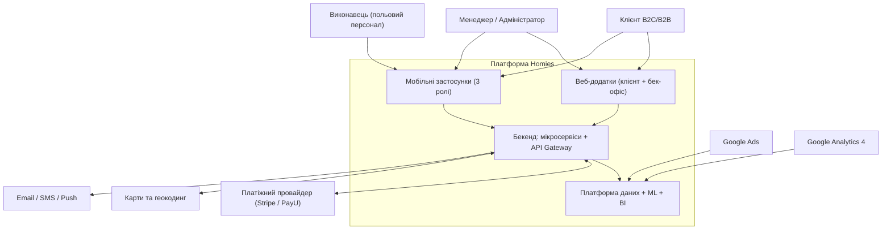
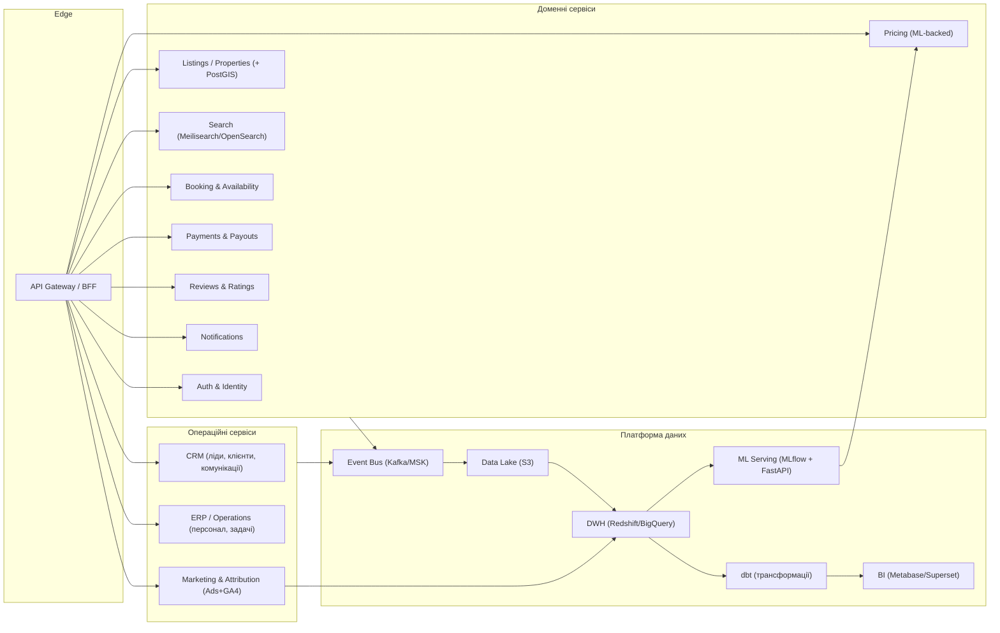
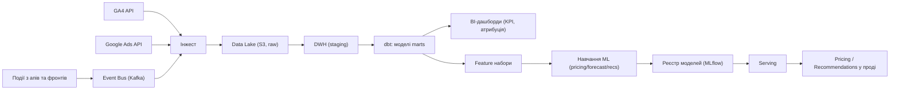
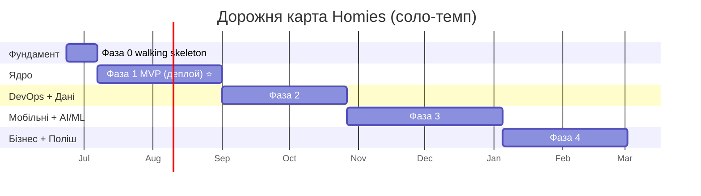
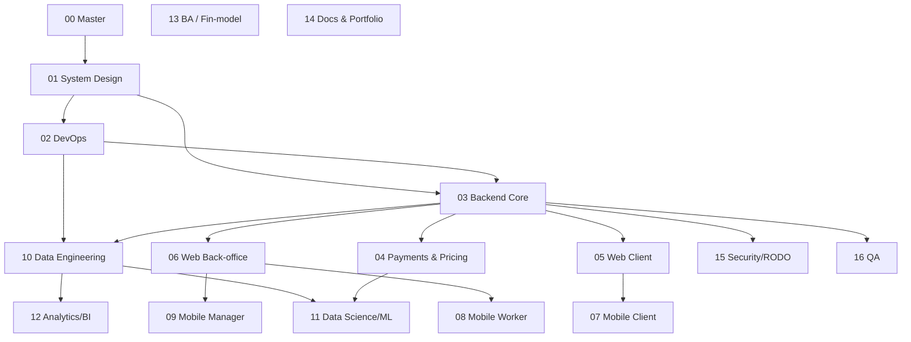

# Homies — Master Project Charter (v1.0)

> **Що це.** Єдиний керівний документ («штаб-квартира») всього проєкту. Він містить рішення, архітектуру, дорожню карту з термінами, декомпозицію на окремі чати з готовими промптами та бізнес-план. Усі інші чати (бекенд, мобільні застосунки, DevOps, дані тощо) орієнтуються на цей документ.
>
> **Як використовувати.** Поклади цей файл у репозиторій як `docs/PROJECT_CHARTER.md`. Відкриваючи новий робочий чат, **прикріплюй цей файл** (або потрібний розділ) — так кожен новий чат миттєво отримує контекст проєкту, навіть якщо не «бачив» попередніх розмов.
>
> **Мова.** Цей робочий charter — українською (твоя мова роботи). Публічні артефакти репозиторію для рекрутерів (головний `README.md`, кейс-стаді) краще зробити **англійською** — це окреме завдання у «Чаті 14: Документація та портфоліо».
>
> **Версія:** 1.0 · **Дата:** 2026-06-19 · **Власник:** ти.

---

## Зміст

1. [TL;DR — головне за 60 секунд](#1-tldr--головне-за-60-секунд)
2. [Стратегічне рішення: Homies чи хімчистка?](#2-стратегічне-рішення-homies-чи-хімчистка)
3. [Що проєкт демонструє: навички → вакансії](#3-що-проєкт-демонструє-навички--вакансії)
4. [Продукт і scope](#4-продукт-і-scope)
5. [Архітектура системи](#5-архітектура-системи)
6. [Технологічний стек](#6-технологічний-стек)
7. [Структура репозиторію (monorepo)](#7-структура-репозиторію-monorepo)
8. [Дорожня карта з термінами](#8-дорожня-карта-з-термінами)
9. [Декомпозиція на чати (карта чатів + промпти)](#9-декомпозиція-на-чати-карта-чатів--промпти)
10. [Бізнес-план](#10-бізнес-план)
11. [AI та prompt engineering у проєкті](#11-ai-та-prompt-engineering-у-проєкті)
12. [Ризики та як їх знизити](#12-ризики-та-як-їх-знизити)
13. [Definition of Done: чек-лист «портфоліо рівня senior»](#13-definition-of-done-чек-лист-портфоліо-рівня-senior)
14. [Як працювати щодня (ритм і дисципліна)](#14-як-працювати-щодня-ритм-і-дисципліна)
15. [Додаток: глосарій і що вчити](#15-додаток-глосарій-і-що-вчити)

---

## 1. TL;DR — головне за 60 секунд

- **Рекомендоване рішення:** будувати **Homies** (платформа оренди житла по Польщі) як *флагман портфоліо*. Причина — маркетплейс дає максимум технічної поверхні для демонстрації DevOps + Data Analyst + Data Engineering + Business Analyst в одному проєкті.
- **Страховка бізнесу:** ~70% архітектури спільні з твоєю клінінг/хімчисткою. Збудувавши Homies, ти отримуєш «скелет», який пізніше можна перенацілити на реальний бізнес, де в тебе вже є експертиза. Тобто ти не втрачаєш бізнес-опцію.
- **Що будуємо:** клієнтський веб, бек-офіс (ERP+CRM) веб, 3 мобільні застосунки (клієнт / виконавець / менеджер), ~12–14 бекенд-сервісів, платформу даних (DWH + ETL + BI), ML (динамічне ціноутворення, прогноз попиту, рекомендації) та інтеграцію Google Ads + GA4.
- **Терміни:** ~**8–9 місяців** соло у стабільному темпі навчання. Критична віха — **розгорнутий працюючий MVP наприкінці ~2.5 місяця**. Готовий і задеплоєний проєкт цінніший за «все, але недороблене».
- **Як організувати роботу:** ~16 окремих чатів-воркстрімів (карта в розділі 9), кожен зі своїм готовим промптом. Цей charter — оркестратор.

---

## 2. Стратегічне рішення: Homies чи хімчистка?

Ти вагаєшся між хімчисткою меблів (HeyHomie, B2C+B2B, ERP+CRM) і платформою оренди (Homies). Розберімо чесно, бо у тебе **дві різні цілі**, які тягнуть у різні боки.

### 2.1 Дві цілі, які варто не плутати

| Ціль | Що для неї краще |
|---|---|
| **Портфоліо + демонстрація навичок** (DevOps/DA/DE/BA), «вау-ефект», історія єдинорога | **Homies** — більше даних, ML, складніша доменна модель, більше мікросервісів, більший наратив |
| **Реальний бізнес, який ти можеш запустити вже зараз** | **Хімчистка/клінінг** — у тебе вже є операційна експертиза, ринок зрозуміліший, легше довести до грошей |

### 2.2 Чому Homies сильніший як портфоліо

Маркетплейс оренди природно вимагає речей, які роблять портфоліо вражаючим і покривають усі чотири сектори вакансій:

- **Геодані** (PostGIS, пошук «поряд зі мною», карти) — рідко хто це показує.
- **Пошук і ранжування** (Meilisearch/OpenSearch) — серйозний Computer Science.
- **Динамічне ціноутворення** — ML-модель (Data Science), яка реально впливає на продукт.
- **Прогноз попиту/заповнюваності** — часові ряди (Data Engineering + DS).
- **Рекомендації** та **антифрод** — ще дві ML-задачі.
- **Двосторонній маркетплейс** (орендарі ↔ власники) — складніша доменна модель → виправдано більше мікросервісів → краща демонстрація **DevOps**.
- **Багатша аналітика** (GMV, конверсії, когорти, атрибуція реклами) → сильний **Data Analyst** і **Business Analyst**.
- **Більша історія ринку** → переконливіший бізнес-план і «unicorn»-наратив.

Хімчистка все це теж дозволяє (маршрутизація виконавців — це класична задача оптимізації, прогноз попиту по районах, churn B2B-клієнтів), але «стеля» багатства даних нижча, а ринок вужчий.

### 2.3 Чому хімчистка сильніша як реальний бізнес

- У тебе вже є **операційний досвід** (клінінг-компанія Homie з робочим веб-додатком).
- Ринок менш конкурентний за оренду (де є Booking, Airbnb, локальні гравці).
- Оренда в Польщі — **сильно зарегульована** (договори найму, короткострокова оренда, податки, RODO/GDPR), двосторонній маркетплейс має проблему «курки і яйця» (немає орендарів без об'єктів і навпаки).

### 2.4 Ключовий інсайт: ~70% архітектури спільні

Обидва бізнеси — це по суті «операційна платформа сервісу» з однаковим скелетом:

- Користувачі та ролі (клієнт / виконавець / менеджер / адмін) — **однаково**
- Замовлення/бронювання (різна суть, однакова форма) — **однаково**
- 3 мобільні застосунки під ролі — **однаково**
- Платежі, нотифікації — **однаково**
- CRM (ліди, клієнти, історія комунікацій) — **однаково**
- ERP (планування ресурсів/персоналу/задач) — **однаково**
- Інтеграція Google Ads + GA4, BI-дашборди — **однаково**
- Адмін-панель — **однаково**

Відрізняється лише **доменне ядро**: `об'єкти + бронювання + ціноутворення` (Homies) проти `замовлення хімчистки + маршрути + виконавці` (HeyHomie).

### 2.5 Рішення

> **Веди проєкт як Homies.** Це дає максимальний технічний розмах для портфоліо і найкращу історію. Архітектуру одразу будуй так, щоб доменне ядро було ізольоване (bounded contexts) — тоді той самий скелет згодом перенацілюється на твій реальний клінінг/хімчистку, де в тебе є експертиза. Так ти отримуєш і вражаюче портфоліо *зараз*, і опцію реального бізнесу *потім*.

Якщо вирішиш, що пріоритет — реальний бізнес уже зараз: бери хімчистку, і весь цей план перенацілюється за день (доменне ядро змінюється, скелет лишається). Решта документа написана під Homies, але архітектурно нейтральна.

---

## 3. Що проєкт демонструє: навички → вакансії

| Навичка / технологія | DevOps | Data Analyst | Data Engineering | Business Analyst |
|---|:---:|:---:|:---:|:---:|
| Docker, Docker Compose | ✅ | | | |
| Kubernetes, Helm, k3s/kind | ✅ | | | |
| Terraform (IaC), AWS | ✅ | | | |
| CI/CD (GitHub Actions), GitOps (ArgoCD) | ✅ | | | |
| Linux, Bash, скрипти автоматизації | ✅ | | | |
| Observability (Prometheus, Grafana, Loki, OTel/X-Ray) | ✅ | | ✅ | |
| SQL, моделювання даних | | ✅ | ✅ | |
| BI-дашборди (Metabase/Superset/Looker) | | ✅ | | ✅ |
| GA4 + Google Ads, маркетингова атрибуція | | ✅ | ✅ | ✅ |
| ETL/ELT (Airflow/Dagster + dbt), DWH (Redshift/BigQuery) | | | ✅ | |
| Стрімінг подій (Kafka/MSK) | ✅ | | ✅ | |
| ML: ціноутворення, прогноз, рекомендації, антифрод | | ✅ | ✅ | |
| MLOps (MLflow, serving) | ✅ | | ✅ | |
| Системний дизайн, мікросервіси, API-контракти | ✅ | | ✅ | |
| BRD/требування, BPMN-процеси, unit-економіка, фін-модель | | | | ✅ |
| KPI, когортний аналіз, A/B | | ✅ | | ✅ |
| Git (trunk-based, conventional commits, semantic release) | ✅ | ✅ | ✅ | ✅ |
| AI / prompt engineering (вбудований у продукт + як інструмент) | ✅ | ✅ | ✅ | ✅ |

**Висновок:** один проєкт закриває всі чотири сімейства вакансій + наскрізні навички (Git, системний дизайн, AI). Рекрутеру з будь-якого сектора буде що подивитися.

---

## 4. Продукт і scope

### 4.1 Що таке Homies (одним абзацом)

Платформа оренди житла по всій Польщі з гнучкими термінами (добова, помісячна, поквартальна, річна). Орендарі шукають і бронюють житло; власники/керуючі публікують об'єкти, керують бронюваннями, цінами й операціями через бек-офіс (ERP+CRM) і мобільний застосунок; платформа заробляє на комісії + SaaS-підписці для власників + просуванні оголошень + додаткових сервісах (зокрема прибирання — синергія з твоїм клінінгом).

### 4.2 Ролі (актори)

- **Клієнт (орендар)** — B2C та B2B (компанії, що орендують житло для працівників).
- **Виконавець (польовий персонал)** — прибиральники, технічне обслуговування, інспекція/check-in об'єктів.
- **Менеджер (адміністратор)** — керуючий об'єктами/операціями, підтримка, фінанси.
- **Адмін платформи** — суперкористувач, налаштування, модерація.

### 4.3 Поверхні (surfaces)

1. **Клієнтський веб** — пошук, фільтри, карта, сторінка об'єкта, бронювання, оплата, кабінет.
2. **Бек-офіс веб (ERP + CRM)** — об'єкти, бронювання, календар, клієнти (CRM), операції/задачі (ERP), фінанси, звіти, дашборди.
3. **Мобільний застосунок — Клієнт** (iOS+Android) — мобільний шлях бронювання, чат, нотифікації, цифрові ключі/інструкції заселення.
4. **Мобільний застосунок — Виконавець** — задачі, чек-листи прибирання/інспекції, фото-звіти, графік, навігація.
5. **Мобільний застосунок — Менеджер** — затвердження, моніторинг, сповіщення, операційний дашборд «на ходу».

> **Прагматична порада:** застосунки «Виконавець» і «Менеджер» можна зробити одним React Native кодом з рольовим доступом до екранів (економія часу), але вести як окремі чати для чіткості дизайну. Клієнтський застосунок — окремий (він публічний, у сторах).

### 4.4 Scope MVP проти «пізніше»

**MVP (мінімум, щоб задеплоїти end-to-end):**
- Auth + ролі; публікація об'єкта; пошук + фільтри + карта; бронювання + календар доступності; оплата (sandbox); базовий бек-офіс (CRUD об'єктів/бронювань + список клієнтів); базові нотифікації; базовий дашборд.

**Пізніше (розширення, кожне = демонстрація навички):**
- Динамічне ціноутворення (ML); прогноз попиту; рекомендації; антифрод; повний ERP (планування персоналу, задачі); повний CRM (воронка, історія комунікацій); 3 мобільні застосунки; AI-підтримка та авто-генерація описів; маркетингова атрибуція; SaaS-підписки для власників.

---

## 5. Архітектура системи

### 5.1 Контекст (C4 рівень 1)



### 5.2 Контейнери / сервіси (C4 рівень 2)



### 5.3 Потік даних (аналітика та ML)



### 5.4 Інфраструктура (AWS, регіон eu-central-1 / Frankfurt — резидентність даних ЄС)

- **Оркестрація:** EKS (Kubernetes) + Helm; ArgoCD для GitOps.
- **Реєстр образів:** ECR. **Балансувальник:** ALB. **DNS:** Route53.
- **Бази:** RDS PostgreSQL (+PostGIS); ElastiCache Redis (кеш/черги).
- **Стрімінг:** MSK (Kafka) або легша альтернатива (NATS/Redpanda) на старті.
- **Дані:** S3 (data lake) → Redshift (DWH) [або BigQuery, якщо тягнеш аналітику в GCP через джерела Google].
- **Секрети:** AWS Secrets Manager. **Observability:** CloudWatch + ADOT (OpenTelemetry) + X-Ray; Prometheus/Grafana/Loki у кластері.
- **Автентифікація:** Cognito або самостійний Keycloak (Keycloak краще показує глибину).
- **Все через Terraform** (IaC). Локально — Docker Compose + k3s/kind.

### 5.5 RODO / GDPR (обов'язково для ЄС-платформи)

Це не лише вимога, а **сильний сигнал зрілості** в портфоліо:
- Обробка PII, згоди (consent), політика зберігання та видалення даних (right to erasure).
- Шифрування at-rest і in-transit; аудит-логи доступу.
- DPA з підрядниками; резидентність даних у ЄС (Frankfurt).
- Псевдонімізація PII в аналітичному контурі (DWH не повинен містити зайвих персональних даних).

---

## 6. Технологічний стек

Стек опініонований і «hireable» (резюмні ключові слова + синергія між шарами). Альтернативи в дужках.

| Шар | Вибір | Чому |
|---|---|---|
| Бекенд (основний) | **Python + FastAPI** | синергія з DE/DS/AI; швидка розробка; типізація через Pydantic |
| Бекенд (1 сервіс для розмаху) | **Go** (опційно) | показати поліглотність і високопродуктивний сервіс (напр. Search-проксі) |
| Веб-фронт | **TypeScript + React (Next.js)** | стандарт індустрії; SSR для SEO клієнтського вебу |
| Бек-офіс UI | React + **Refine / react-admin** | швидко зібрати CRUD-адмінку ERP/CRM |
| Мобільні застосунки | **React Native (Expo)** | один код під iOS+Android; синергія з React (або Flutter, якщо ближче) |
| Основна БД | **PostgreSQL (+PostGIS)** | надійність + геозапити |
| Кеш/черги | **Redis** | кеш, rate-limit, легкі черги |
| Пошук | **Meilisearch** (або OpenSearch) | швидкий релевантний пошук об'єктів |
| Події/стрімінг | **Kafka/MSK** (старт: NATS/RabbitMQ) | подієва архітектура для DE-демонстрації |
| Контейнери | **Docker + Docker Compose** | локальна розробка одним рядком |
| Оркестрація | **Kubernetes (k3s/kind лок., EKS прод) + Helm** | ядро DevOps-демонстрації |
| GitOps | **ArgoCD** | декларативні деплої з Git |
| IaC | **Terraform** | вся інфра як код |
| CI/CD | **GitHub Actions** | матриці, кеш, build+test+scan+deploy |
| DWH | **Redshift** (або BigQuery) | сховище для аналітики |
| ETL/ELT | **Airflow** (або Dagster/Prefect) **+ dbt** | оркестрація пайплайнів + трансформації |
| Локальна аналітика | **DuckDB** | швидкі експерименти з даними без хмари |
| BI | **Metabase** (або Superset) | дашборди KPI та атрибуції |
| ML | **scikit-learn, XGBoost/LightGBM, statsforecast/Prophet** | ціни, прогноз, рекомендації |
| MLOps | **MLflow** + serving через FastAPI/BentoML | трекінг і подача моделей |
| Observability | **Prometheus, Grafana, Loki, OpenTelemetry, X-Ray** | метрики, логи, трейси |
| Платежі | **Stripe** (для портфоліо) / **PayU/Przelewy24** (PL) | оплати + виплати власникам |

---

## 7. Структура репозиторію (monorepo)

Monorepo спрощує узгодження контрактів і вражає охайністю. Приклад:

```
homies/
├─ README.md                      # англомовний публічний опис (для рекрутерів)
├─ docs/
│  ├─ PROJECT_CHARTER.md          # цей файл
│  ├─ adr/                        # Architecture Decision Records
│  ├─ diagrams/                   # C4, потоки даних (Mermaid/PNG)
│  ├─ api/                        # OpenAPI / AsyncAPI контракти
│  └─ runbooks/                   # експлуатаційні інструкції
├─ services/
│  ├─ auth/
│  ├─ listings/
│  ├─ search/
│  ├─ booking/
│  ├─ pricing/
│  ├─ payments/
│  ├─ notifications/
│  ├─ crm/
│  ├─ erp/
│  └─ marketing/
├─ apps/
│  ├─ web-client/                 # Next.js
│  ├─ web-backoffice/             # ERP+CRM
│  ├─ mobile-client/              # React Native
│  ├─ mobile-worker/
│  └─ mobile-manager/
├─ data/
│  ├─ ingestion/                  # конектори GA4/Ads, інжест подій
│  ├─ airflow/                    # DAGs
│  ├─ dbt/                        # моделі та тести даних
│  └─ ml/                         # ноутбуки, тренування, моделі, model cards
├─ infra/
│  ├─ terraform/                  # модулі AWS
│  ├─ helm/                       # чарти сервісів
│  ├─ argocd/                     # GitOps маніфести
│  └─ k8s/                        # базові маніфести
├─ ops/
│  ├─ docker-compose.yml          # локальний запуск усього
│  ├─ scripts/                    # bash-автоматизація
│  └─ monitoring/                 # Prometheus/Grafana/Loki конфіги
├─ .github/workflows/             # CI/CD пайплайни
└─ Makefile                       # `make up`, `make test`, `make deploy`
```

---

## 8. Дорожня карта з термінами

> **Чесно про темп.** Збудувати геть усе (веб + 3 мобільні + мікросервіси + DE + DS + повний DevOps + бізнес-план) соло до продакшн-якості — це **12–18+ місяців** фултайму. Тому стратегія така: спершу довести до **задеплоєного MVP** (це вже сильніше за 90% портфоліо), потім нарощувати «вертикальні зрізи» під кожну навичку. **Готове і задеплоєне > все, але недороблене.**

Терміни нижче — для **стабільного соло-темпу з навчанням** (≈2–4 год/день). Це діапазони, не дедлайни.

### Фаза 0 — Фундамент (Тиждень 1–2)
Monorepo, структура, ADR, доменна модель + bounded contexts, OpenAPI-контракти, локальний `docker-compose`, скелет CI, дошка GitHub Projects. **Результат:** «walking skeleton» — порожній, але запускається `make up`.

### Фаза 1 — Ядро MVP (Тижні 3–10, ~2 міс) ⭐ КРИТИЧНА ВІХА
Бекенд-ядро (auth, listings, search, booking, payments-sandbox), клієнтський веб, базовий бек-офіс, деплой у невеликий k8s-кластер, базовий CI/CD, базова observability. **Результат: працює end-to-end, є жива демо-URL.** Не пропускати — це фундамент усього портфоліо.

### Фаза 2 — DevOps вглиб + фундамент даних (Тижні 11–18, ~2 міс)
Повний Terraform IaC, Helm, ArgoCD (GitOps), матриці GitHub Actions, Prometheus/Grafana/Loki, blue-green/canary деплої. Далі: трекінг подій → S3 → DWH → перший Airflow+dbt пайплайн → інжест GA4/Ads → перші BI-дашборди.

### Фаза 3 — Мобільні застосунки + AI/ML (Тижні 19–28, ~2.5 міс)
Клієнтський мобільний застосунок (RN), далі виконавець + менеджер. ML: динамічне ціноутворення, прогноз попиту, рекомендації. AI-фічі: підтримка-асистент, авто-генерація описів об'єктів, розумний пошук — з письмовими розборами prompt engineering.

### Фаза 4 — Загартовування + бізнес + портфоліо (Тижні 29–36, ~2 міс)
Безпека + RODO, навантажувальне тестування, автоматизація QA, **фінансова модель (xlsx) + BRD + BPMN-процеси**, документація, демо-відео, кейс-стаді, англомовний README, поліш репозиторію.



**Разом ≈ 8–9 місяців**, з вражаючою демонстрованою вiхою вже на ~2.5 місяці.

---

## 9. Декомпозиція на чати (карта чатів + промпти)

Кожен воркстрім — окремий чат. Цей charter — оркестратор. **Прикріплюй цей файл до кожного нового чату**, щоб він мав контекст.

### 9.1 Карта чатів і порядок

| # | Чат | Призначення | Фаза | Залежить від |
|---|---|---|---|---|
| 00 | **Master / Charter** (цей чат) | оркестрація, рішення, апдейти плану | усі | — |
| 01 | **System Design & Contracts** | доменна модель, bounded contexts, OpenAPI/AsyncAPI, ADR, C4 | 0 | 00 |
| 02 | **DevOps / Infrastructure** | Docker, Compose, k8s, Helm, Terraform, CI/CD, ArgoCD, observability | 0→2 | 01 |
| 03 | **Backend: Core domain** | auth, listings, search, booking | 1 | 01, 02 |
| 04 | **Backend: Payments & Pricing** | оплати, виплати, сервіс цін | 1→3 | 03 |
| 05 | **Web — Client** | Next.js клієнтський веб | 1 | 03 |
| 06 | **Web — Back-office (ERP+CRM)** | бек-офіс, CRM, ERP, звіти | 1→3 | 03 |
| 07 | **Mobile — Client** | RN застосунок орендаря | 3 | 03, 05 |
| 08 | **Mobile — Worker** | RN застосунок виконавця | 3 | 06 |
| 09 | **Mobile — Manager** | RN застосунок менеджера | 3 | 06 |
| 10 | **Data Engineering** | event tracking, S3, DWH, Airflow, dbt, інжест GA4/Ads | 2 | 02, 03 |
| 11 | **Data Science / ML** | ціноутворення, прогноз, рекомендації, антифрод, MLflow | 3 | 10 |
| 12 | **Analytics / BI / Attribution** | дашборди, KPI, ROI реклами (Ads+GA4) | 2→4 | 10 |
| 13 | **Business Analyst / Financial Model** | бізнес-план, unit-економіка, **фін-модель xlsx**, BRD, BPMN | 4 | — |
| 14 | **Docs & Portfolio polish** | англ. README, діаграми, демо-відео, кейс-стаді | 4 | усі |
| 15 | **Security & Compliance (RODO)** | authn/authz, GDPR, threat modeling, секрети | 2→4 | 02, 03 |
| 16 | **QA & Testing** | стратегія тестів, unit/integration/e2e, навантаження | 1→4 | 03 |

### 9.2 Граф залежностей чатів



### 9.3 Шаблон промпта для будь-якого чату

```
Контекст: я будую Homies — платформу оренди житла по Польщі як портфоліо-проєкт,
що демонструє навички DevOps / Data Analyst / Data Engineering / Business Analyst.
Майстер-план — у прикріпленому файлі PROJECT_CHARTER.md (бери з нього архітектуру,
стек, контракти й термінологію).

Цей чат відповідає за: <КОМПОНЕНТ>.
Стек цього компонента: <СТЕК>.
Я працюю соло і навчаюсь — пояснюй кроки з аналогіями, давай робочий код і команди,
показуй best practices та поширені помилки.

Мета цього чату: <DELIVERABLES — що маємо отримати на виході>.

Почни з: (1) короткого плану цього компонента, (2) переліку передумов,
(3) першого практичного кроку з кодом/командами.
```

### 9.4 Готові промпти для перших чатів (старт роботи)

**Чат 01 — System Design & Contracts:**
```
Контекст: будую Homies — портфоліо-платформу оренди житла (DevOps/DA/DE/BA).
Майстер-план у прикріпленому PROJECT_CHARTER.md.

Цей чат: системний дизайн і контракти.
Деліверабли: (1) доменна модель і bounded contexts (DDD), (2) перелік мікросервісів
з відповідальностями, (3) OpenAPI-контракти ключових сервісів (auth, listings, booking),
(4) схема подій (AsyncAPI) для event bus, (5) 5–7 ADR щодо ключових рішень,
(6) C4-діаграми (контекст + контейнери) у Mermaid.

Почни з доменної моделі та переліку bounded contexts, далі узгодимо контракти.
Працюю соло і навчаюсь — пояснюй рішення й компроміси.
```

**Чат 02 — DevOps / Infrastructure:**
```
Контекст: будую Homies — портфоліо-платформу оренди (DevOps/DA/DE/BA).
Майстер-план у прикріпленому PROJECT_CHARTER.md; контракти візьму з Чату 01.

Цей чат: вся інфраструктура й DevOps.
Стек: Docker, Docker Compose, Kubernetes (k3s/kind лок., EKS прод), Helm, Terraform,
GitHub Actions, ArgoCD, Prometheus/Grafana/Loki, OpenTelemetry, AWS (eu-central-1).
Деліверабли: (1) docker-compose для локального запуску всього, (2) базові k8s-маніфести
+ Helm-чарти, (3) Terraform-модулі під AWS (EKS/RDS/ECR/ALB/Route53/S3/Secrets),
(4) CI/CD пайплайни (build+test+scan+push+deploy), (5) GitOps через ArgoCD,
(6) стек observability з дашбордами.

Почни з локального оточення (docker-compose + Makefile), далі підемо до k8s і хмари.
Пояснюй кроки з аналогіями — я навчаюсь.
```

**Чат 03 — Backend: Core domain:**
```
Контекст: будую Homies — портфоліо-платформу оренди (DevOps/DA/DE/BA).
Майстер-план у прикріпленому PROJECT_CHARTER.md; контракти — з Чату 01;
інфра — з Чату 02.

Цей чат: ядро бекенду на Python + FastAPI.
Сервіси: auth & identity (ролі: client/worker/manager/admin), listings (+PostGIS),
search (Meilisearch), booking (доступність + бронювання). БД PostgreSQL, Redis, події в Kafka.
Деліверабли: робочі сервіси з тестами, міграціями, Dockerfile, OpenAPI, що піднімаються
в docker-compose і проходять CI.

Почни з auth-сервісу (схема даних, ендпойнти, JWT/OIDC, ролі), далі listings.
Я навчаюсь — давай робочий код, пояснення й типові помилки.
```

**Чат 13 — Business Analyst / Financial Model:**
```
Контекст: будую Homies — платформу оренди житла по Польщі. Майстер-план у
прикріпленому PROJECT_CHARTER.md (розділ 10 — бізнес-план з припущеннями-плейсхолдерами).

Цей чат: довести бізнес-план до рівня BA-портфоліо.
Деліверабли: (1) дослідження ринку оренди в Польщі з реальними джерелами,
(2) валідовані припущення (ренти по містах, CAC через Google Ads, take rate),
(3) фінансова модель у xlsx: P&L на 3 роки, unit-економіка (CAC/LTV/contribution margin,
payback), сценарії (песимістичний/базовий/оптимістичний), (4) BRD ключових фіч,
(5) BPMN ключових процесів (бронювання, онбординг власника).

Почни з дослідження ринку та переліку припущень, які треба валідувати,
далі збудуємо xlsx-модель. Усі числа мають спиратися на джерела, не вигадані.
```

> Решта чатів (04–12, 14–16) запускаються за тим самим шаблоном (9.3) у міру проходження фаз.

---

## 10. Бізнес-план

> ⚠️ **Важливо про числа.** Цифри в цьому розділі — **ілюстративні плейсхолдери**, щоб показати *метод* розрахунку, а не ринкові факти. Реальні валідовані числа з джерелами та повна **фінансова модель у xlsx** будуються в **Чаті 13**. Не подавай ці плейсхолдери як факти.

### 10.1 Позиціювання

Нішевий старт замість «вбити Booking»: одне місто (напр. Варшава) + один сегмент (помісячна оренда для професіоналів та B2B-релокацій). Перевага — гнучкі терміни + інтегровані сервіси (прибирання, обслуговування, депозит/страхування) + зручний інструмент для власників (ERP/CRM-SaaS).

### 10.2 Модель доходу (кілька потоків)

1. **Комісія маркетплейсу** — % від вартості бронювання (take rate).
2. **SaaS-підписка для власників/керуючих** — тарифи за доступ до ERP/CRM (MRR).
3. **Просування оголошень** (featured listings) — реклама всередині платформи.
4. **Додаткові сервіси** — прибирання (синергія з твоїм клінінгом!), обслуговування, страхування депозиту.

### 10.3 Структура витрат

**CAPEX / разові (старт):**
- Розробка (твій час — альтернативна вартість), дизайн, бренд, юридично-RODO налаштування.

**OPEX / щомісячні:**
- Хмара (EKS/RDS/S3/Redshift/трафік) — *плейсхолдер, валідувати в AWS-калькуляторі*.
- Сторонні API: комісії Stripe/PayU, SMS, карти, GA.
- Маркетинг: бюджет Google Ads.
- Команда (якщо найм; соло = твій час), підтримка, бухгалтерія/юрист, домен/SSL/інше.

### 10.4 Unit-економіка (визначення метрик)

- **GMV** — сумарна вартість бронювань.
- **Revenue** = GMV × take rate + MRR (SaaS) + реклама + сервіси.
- **CAC** = маркетингові витрати / кількість залучених клієнтів.
- **LTV** = середня кількість бронювань × середня комісія × тривалість утримання.
- **Contribution margin** = revenue − змінні витрати (комісії платежів, інфра на бронювання, підтримка).
- **LTV/CAC** (ціль > 3), **payback period** (ціль < 12 міс).

### 10.5 Ілюстративна модель P&L (ПЛЕЙСХОЛДЕРИ — замінити в Чаті 13)

Таблиця показує **як рахується прибуток**, а не реальні значення.

| Параметр (вхід) | Плейсхолдер | Звідки брати реальне |
|---|---|---|
| Активних об'єктів (рік 1) | 300 | онбординг власників × конверсія |
| Бронювань на об'єкт/міс | 0.7 | заповнюваність ринку |
| Середня вартість бронювання | 3 500 PLN | реальні ренти по місту |
| Take rate | 10% | бенчмарк конкурентів |
| Платних SaaS-власників | 80 | конверсія в підписку |
| Середній MRR з власника | 99 PLN | твоя тарифна сітка |
| CAC на клієнта | 120 PLN | Google Ads: вартість / конверсії |

**Як рахується (формули):**
```
GMV/міс            = Об'єкти × Бронювань_на_об'єкт × Сер.вартість
Комісія/міс        = GMV × take_rate
SaaS MRR           = Платних_власників × Сер.MRR
Виручка/міс        = Комісія + SaaS + Реклама + Сервіси
Валовий прибуток   = Виручка − COGS (комісії платежів + інфра/бронювання + підтримка)
EBITDA             = Валовий прибуток − OPEX (маркетинг + зарплати + юр/бух + інше)
```

> Підстав свої валідовані числа — і отримаєш прибуток. Саме це збудуємо як інтерактивний xlsx зі сценаріями в Чаті 13.

### 10.6 Фінансування і runway

- **Bootstrap** (твій час + мінімальна хмара) проти **seed-раунду**.
- `Runway (міс) = кеш / місячний burn`. На старті тримай burn низьким (нішевий запуск, безсерверні/дешеві ресурси, соло-розробка).

### 10.7 KPI-дашборд (будується в Чаті 12)

GMV · take rate · активні об'єкти · заповнюваність · конверсія пошук→бронювання · CAC · LTV · LTV/CAC · churn · NPS · MRR (SaaS) · когортне утримання · ROI Google Ads (через атрибуцію GA4+Ads).

---

## 11. AI та prompt engineering у проєкті

Ти хочеш показати вміння **ефектно й ефективно** користуватися AI. Це робиться двома способами.

### 11.1 AI як частина продукту

- **AI-асистент підтримки** (RAG по базі знань + бронюваннях клієнта).
- **Авто-генерація описів об'єктів** для власників (з фото + параметрів).
- **Розумний пошук** — інтерпретація запиту природною мовою у фільтри.
- **Наративи аналітики** — авто-пояснення аномалій у метриках для менеджерів.
- **Антифрод-сигнали** + AI-резюме підозрілих кейсів.

### 11.2 Prompt engineering як навичка (щоб це було видно в репозиторії)

- Каталог промптів `docs/prompts/` з версіонуванням і описом задач.
- **Евали промптів** (наприклад, набір тестів і метрик якості відповідей).
- Розбори (writeups): «як я ітерував промпт», few-shot vs zero-shot, структуровані виходи (JSON), guardrails.
- Демонстрація **structured outputs** і ланцюжків (де доречно) у реальних фічах.

---

## 12. Ризики та як їх знизити

| Ризик | Вплив | Зниження |
|---|---|---|
| Перевантаження scope (соло) | проєкт не завершено | спершу задеплоїти MVP (Фаза 1), потім розширювати; «готове > все» |
| Cold-start маркетплейсу | мало об'єктів і клієнтів | нішевий старт; засів пропозиції (supply-first); 1 місто |
| Регуляторика оренди (PL) | юридичні проблеми | RODO та юр-аспекти закладати рано (Чат 15); для портфоліо — sandbox-платежі |
| Складність платежів/escrow | блокери | Stripe sandbox; escrow/виплати спрощено на старті |
| Конкуренція (Booking/Airbnb) | складно як бізнес | для портфоліо не критично; як бізнес — ніша + сервіси-надбудови |
| Технічний борг при навчанні | гальмує пізніше | тести з Фази 1 (Чат 16), CI-гейти, ADR-рішення |
| Розпорошення між технологіями | поверхневість | один опініонований стек (розділ 6); глибина важливіша за ширину |

---

## 13. Definition of Done: чек-лист «портфоліо рівня senior»

Те, що відрізняє вражаюче портфоліо від «ще одного pet-project»:

- [ ] **Жива демо-URL** (клієнтський веб задеплоєний і працює).
- [ ] **Англомовний README** з GIF/скриншотами та архітектурною діаграмою.
- [ ] **Один рядок на запуск локально**: `make up` (docker-compose підіймає все).
- [ ] **CI-бейджі** + покриття тестами; зелений пайплайн.
- [ ] **Kubernetes-маніфести/Helm + Terraform** у репо (видно DevOps).
- [ ] **GitOps (ArgoCD)** конфіги.
- [ ] **Скриншоти дашбордів** Grafana (observability) і Metabase (BI).
- [ ] **dbt docs** + тести даних; описані ML **model cards**.
- [ ] **ADR-и** (видно, що ти приймаєш інженерні рішення усвідомлено).
- [ ] **Conventional commits** + semantic releases; чиста історія Git.
- [ ] **Демо-відео** (Loom, 3–5 хв) з проходом по продукту й архітектурі.
- [ ] **Кейс-стаді** під кожен сектор (DevOps / DA / DE / BA) — короткі writeups «задача → рішення → результат».
- [ ] **Фінансова модель (xlsx)** + BRD + BPMN у `docs/`.
- [ ] **Dev-log** (журнал розробки) — показує послідовність і навчання.

---

## 14. Як працювати щодня (ритм і дисципліна)

- **Темп:** 2–4 год/день навчання+коду; **щотижня — одна закінчена віха** (мерж у `main`).
- **Один воркстрім = один чат** (карта в розділі 9). На початку нового чату — **прикріпи цей charter**.
- **Трекінг:** GitHub Projects (колонки Backlog → In progress → Review → Done), задачі з фаз.
- **Git-гігієна:** маленькі коміти щодня, conventional commits, PR навіть наодинці (це сам по собі сигнал).
- **Dev-log:** короткий запис «що зробив / що вивчив / що далі» — це і дисципліна, і матеріал для кейс-стаді.
- **Правило фокусу:** не починай нову фазу, поки попередня не задеплоєна/не закрита по DoD.
- **Раз на 2 тижні** повертайся в цей Master-чат: онови charter (нова версія), переглянь план.

---

## 15. Додаток: глосарій і що вчити

- **DDD / bounded context** — як розрізати домен на незалежні частини.
- **C4 model** — рівні діаграм (контекст → контейнери → компоненти → код).
- **ADR** — короткий запис архітектурного рішення та його причин.
- **IaC (Terraform)** — інфраструктура як код.
- **GitOps (ArgoCD)** — стан кластера керується з Git.
- **ETL/ELT, dbt, DWH** — конвеєр і трансформації даних, аналітичне сховище.
- **OTel / трейсинг** — наскрізне відстеження запитів між сервісами.
- **Unit-економіка (CAC/LTV)** — економіка одного клієнта.
- **BPMN** — нотація бізнес-процесів.
- **Take rate / GMV / MRR** — ключові маркетплейс-метрики.

---

*Кінець charter v1.0. Наступний крок: відкрити **Чат 01 — System Design & Contracts**, прикріпити цей файл і запустити промпт із розділу 9.4.*
