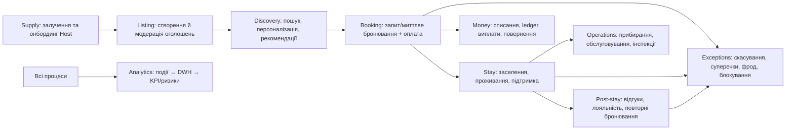
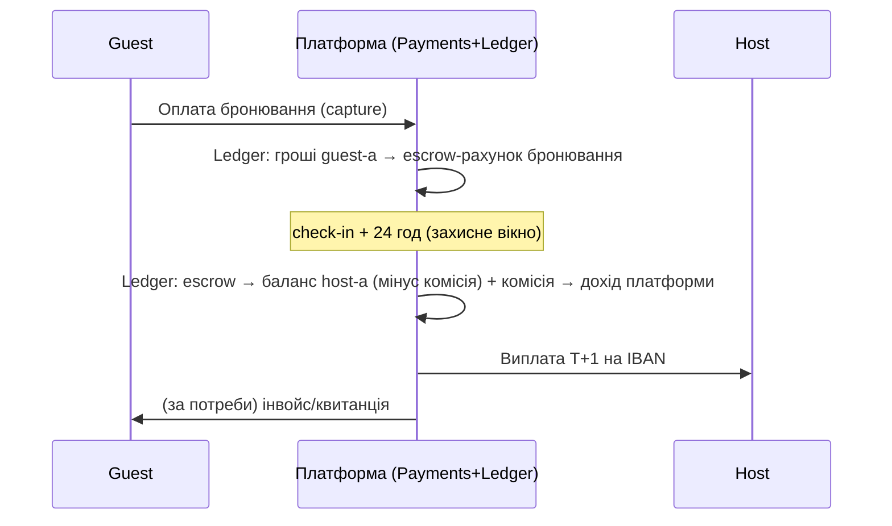

# 02 — Бізнес-процеси і флоу

## 1. Карта макропроцесів

Кожен макропроцес нижче розкритий до рівня: тригер → кроки → статуси →
винятки → автоматизація → взаємодія систем.

---

## 2. Guest: повний життєвий цикл

### 2.1 Реєстрація та авторизація

- **Канали**: email+пароль, телефон+OTP, Google/Apple SSO. B2B — запрошення
  адміністратором компанії.
- **Прогресивна реєстрація**: пошук і перегляд — без акаунта; акаунт
  потрібен для бронювання, збережених списків, повідомлень.
- **Рівні верифікації Guest** (розширюються з ризиком транзакції):
  L0 email/телефон підтверджені → L1 платіжний метод пройшов перевірку →
  L2 документ (ID) верифікований. Instant Book у host-а може вимагати L2.
- **Винятки**: злиття акаунтів (той самий телефон/email), відновлення
  доступу, підозра на перебір паролів → rate-limit + step-up (OTP).
- **Автоматизація**: velocity-перевірки реєстрацій (багато акаунтів з
  одного пристрою/IP → тіньовий ризик-скоринг, не блокування одразу).

### 2.2 Профіль

Дані: ім'я, фото, мова, валюта відображення, підтверджені контакти,
платіжні методи (токенізовані у провайдера — платформа не зберігає PAN),
документи верифікації (сховище T&S, не видно іншим), налаштування
сповіщень, юридичні згоди (версійовані!), B2B-атрибути.
**Видалення акаунта** (GDPR right to erasure): анонімізація PII зі
збереженням транзакційної історії для фінзвітності (легальна підстава).

### 2.3 Пошук, фільтрація, карта

- Пошук: місто/адреса/«поруч зі мною» (гео), дати, гості; фільтри: ціна,
  тип житла, кімнати, зручності, миттєве бронювання, правила (тварини,
  діти), рейтинг, тип host-а.
- **Бізнес-логіка ранжування** (не тільки релевантність!): якість
  оголошення (фото, повнота), конверсія оголошення, рейтинг, частка
  скасувань host-ом (штрафує ранг), свіжість календаря, ціна відносно
  ринку. Ранжування — власний актив платформи.
- Календарна чесність: показуємо тільки об'єкти, доступні на дати запиту;
  ціна в видачі = повна ціна за період (боротьба з drip pricing, вимога ЄС).
- **Винятки**: нуль результатів → м'яке розширення (сусідні дати/райони,
  підписка «повідомити про появу»).

### 2.4 Бронювання та оплата

Два режими (обирає host per-listing):

- **Instant Book**: доступність підтверджена → оплата → `confirmed`.
- **Request to Book**: guest робить запит з утриманням коштів
  (authorization hold), host має **24 год** відповісти; немає відповіді →
  авто-відхилення, повне звільнення холду, штраф до рангу host-а.

Кроки: вибір дат → розрахунок ціни (посуточно + збори, повна прозорість)
→ перевірка правил (min/max nights, вік, кількість гостей) →
Idempotency-Key → оплата (hold → capture за політикою) → підтвердження →
ваучер/інструкції. Статуси — див. документ 05.

**Винятки**: подвійне бронювання (race) — блокування календаря
транзакційне, той хто перший оплатив; відмова платежу → 30 хв на повтор,
далі авто-скасування; овербукінг з вини host-а → примусове переселення
(процес у 06).

### 2.5 Проживання (Stay)

Check-in інструкції (видаються після повної оплати, за N годин до
заселення), чат з host-ом, кнопка «проблема при заселенні» —
**критичний флоу**: якщо неможливо заселитись (брудно/не існує/host
недоступний) — таймер 2 год на реакцію host-а, далі авто-ескалація:
переселення в альтернативу або повне повернення + компенсація (див. 06).

### 2.6 Post-stay: відгуки і рейтинг

- **Double-blind** відгуки (Airbnb-практика): 14 днів на відгук, публікація
  одночасна або після дедлайну — прибирає помсту/тиск.
- Відгук тільки після завершеного проживання (verified stay).
- Оцінки за категоріями (чистота, точність опису, заселення, комунікація,
  розташування, цінність) + загальна.
- Модерація: автофільтри (PII, образи, посилання) → черга модератора для
  сірих випадків. Host може відповісти публічно.

### 2.7 Скасування і повернення коштів

- Політики скасування — **стандартизовані платформою** (Гнучка / Помірна /
  Сувора), host обирає одну; кастомні політики заборонені (порівнюваність
  і автоматизація повернень).
- Повернення рахується автоматично за політикою + правило «extenuating
  circumstances» (форс-мажор — рішення платформи, не host-а).
- Скасування host-ом — завжди 100% повернення guest-у + автоматичний
  штраф host-у + блокування дат у календарі + позначка на профілі
  (анти-патерн «скасував заради дорожчого гостя»).

### 2.8 Повідомлення, підтримка, сповіщення

- **Messaging** — внутрішній чат (guest↔host, прив'язаний до
  запиту/бронювання). Маскування контактів до підтвердженого бронювання
  (анти-дезінтермедіація + безпека). Автовиявлення обміну телефонами/
  платежами поза платформою → м'яке попередження → ризик-сигнал.
- **Support** — тікети: канали (чат, email), категорії, SLA за
  пріоритетом (P1 «не можу заселитись зараз» — реакція ≤15 хв, 24/7).
- **Сповіщення** — єдиний сервіс (Notifications): push/email/SMS,
  налаштування користувача, транзакційні не вимикаються.

### 2.9 Лояльність, рекомендації, персоналізація

- Лояльність (V2): рівні за кількістю/сумою бронювань → перки
  (пріоритетна підтримка, ранній доступ до акцій). Механіка — після
  затвердження монетизації.
- Рекомендації: «схожі об'єкти», «знову в місто X», добірки; на основі
  подій переглядів/бронювань (ML-контур, фаза 3 charter-а).
- Персоналізація: мова, валюта, збережені пошуки, wishlist-и.

---

## 3. Host: повний життєвий цикл

### 3.1 Онбординг і верифікація

1. Реєстрація ролі Host на існуючому акаунті.
2. **KYC**: фізособа — документ + селфі-звірка (провайдер);
   юрособа/PM — KYB: реєстрові дані, бенефіціари, банківський рахунок.
   Виплати **заблоковані до проходження KYC** (AML-вимога), але створювати
   оголошення можна паралельно — не гальмуємо supply.
3. Платіжний профіль виплат (IBAN), податкові дані (для звітності
   DAC7 в ЄС — платформа зобов'язана репортити доходи host-ів!).

### 3.2 Створення об'єкта і модерація

Майстер оголошення: тип житла → адреса (нормалізація + гео) → кімнати/
місткість → зручності → фото (мінімум N, авто-перевірка якості) → опис
(AI-асист генерації — фаза 3) → правила проживання → політика скасування
→ ціни → календар.
**Модерація**: автоматична (фото: якість/водяні знаки/сторонні логотипи;
текст: контакти, дискримінаційні формулювання; адреса: дублікати того
самого об'єкта) → сірі випадки в чергу модератора → `active`.
Санкції за фейк: зняття з публікації, при повторі — блокування host-а.

### 3.3 Календар і доступність

- Джерела блокувань: бронювання (факт), ручні блокування host-а,
  синхронізація iCal/channel manager (V2), правила (мін. розрив між
  заїздами на прибирання).
- **Свіжість календаря** — метрика якості: застарілий календар →
  зниження в ранжуванні; підтверджений host-ом «календар актуальний» —
  підвищення.

### 3.4 Ціни, сезонність, акції

- Базова ціна за ніч + сезонні правила (діапазони дат) + правила
  вихідних + знижки за тривалість (тижнева/місячна) + плата за
  прибирання + за додаткового гостя.
- **Smart Pricing (ML)** — рекомендована ціна з прогнозу попиту; host
  вмикає авто-режим у своїх межах (min/max). Фаза 3.
- Акції: знижка новим оголошенням (перші 3 бронювання), знижка
  last-minute / early-bird. Всі акції — типізовані платформою (не
  довільний текст), щоб рахувались у ціні автоматично.

### 3.5 Управління бронюваннями

Підтвердження (Instant/Request), повідомлення guest-ам, зміни бронювання
(зміна дат — двостороннє погодження з перерахунком), скасування
(зі штрафами), список заїздів/виїздів на сьогодні-завтра (операційний
екран + мобільний застосунок).

### 3.6 Фінанси host-а

Дашборд: заробіток (нараховано/очікується/виплачено), звіти по об'єктах,
експорт CSV, інвойси платформи на комісію, податкове зведення за рік.
Виплати: T+1 після check-in+24h (захисне вікно на «не зміг заселитись»),
на IBAN; статуси виплат — документ 05. Утримання: штрафи, компенсації
guest-ам за рішеннями суперечок — через ledger, прозоро в кабінеті.

### 3.7 Аналітика і рекомендації host-у

Конверсія перегляд→бронювання, заповнюваність vs ринок, позиція ціни vs
схожі об'єкти, вплив фото/опису; **рекомендації** («додайте фото кухні»,
«ваша ціна на 15% вище медіани на ваші дати») — автоматичні, з подій.

### 3.8 Якість, рейтинг, санкції host-а

- Складовий **Host Quality Score**: рейтинг відгуків, частка скасувань,
  швидкість відповіді, частка проблем при заселенні, свіжість календаря.
- Пороги: score нижче X → попередження + план покращення; систематично →
  зниження в пошуку → делістинг. Статус «Superhost»-аналог (V2) за
  стабільно високий score.
- Санкції: типізовані (штраф за скасування, за невідповідність опису),
  нараховуються автоматично, оскаржуються через суперечку (06).

---

## 4. Admin Operations Center: процеси

| Процес | Зміст | Режим |
|---|---|---|
| Live Monitoring | сьогоднішні заїзди/виїзди, активні P1-інциденти, потік бронювань/платежів у реальному часі, здоров'я платіжного провайдера | real-time (події) |
| Черга модерації | нові/змінені оголошення, фото, відгуки, скарги на контент | SLA 24 год |
| Черга T&S | KYC-рев'ю, фрод-алерти, аномалії, запити на блокування | SLA за ризиком |
| Черга суперечок | кейси 3-го рівня (див. 06) | SLA 72 год |
| Фінанси | звірки провайдер↔ledger, ручні повернення/виплати (maker-checker), failed payouts | щоденно |
| KPI/аналітика | GMV, take rate, конверсія, когорти, unit-економіка, ROI каналів | DWH/BI |
| Конфігурація | правила, ролі, ліміти, довідники (міста, типи житла, зручності), фіче-флаги | Platform Admin |
| Аудит | журнал усіх дій людей і системи, пошук, експорт для комплаєнсу | append-only |

**Принцип**: адмінка **не CRUD-панель**, а система черг винятків +
real-time огляд. Все, що не виняток — робить система (документ 03).

---

## 5. Наскрізні business flows (end-to-end)

### 5.1 «Щасливий шлях» грошей

### 5.2 Проблема при заселенні (P1)

Guest натискає «не можу заселитись» → таймер host-а 2 год → немає
рішення → Support пропонує: (а) альтернативне житло (доплата за рахунок
платформи/host-а), (б) повне повернення + купон. Виплата host-у
заморожується до вирішення. Подія в ризик-профіль host-а.

### 5.3 Від оголошення до першої виплати (Host)

Реєстрація → KYC (паралельно) → оголошення → модерація → `active` →
перше бронювання → заселення+24h → ledger-розподіл → виплата T+1.
Вузькі місця контролюємо метриками: time-to-first-listing,
time-to-first-booking, KYC pass rate.

### 5.4 Життєвий цикл проблеми (будь-якої)

Виникнення (кнопка/автодетект) → класифікація (авто) → самообслуговування
(FAQ/бот) → тікет L1 → ескалація L2/T&S/Disputes за типом → рішення →
пост-перевірка (виконання рішення: гроші, статуси) → зворотній зв'язок
(CSAT). Кожен перехід — з SLA і таймером (06).
